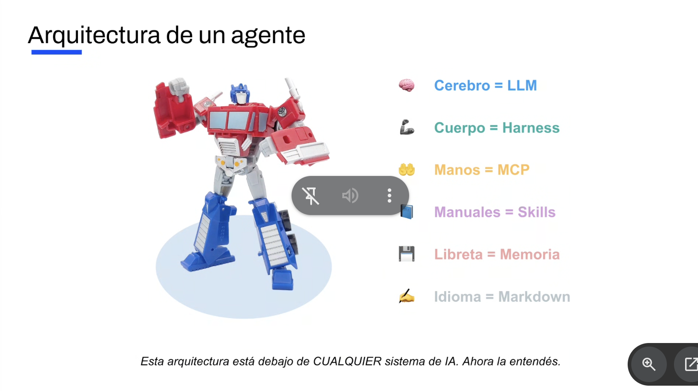
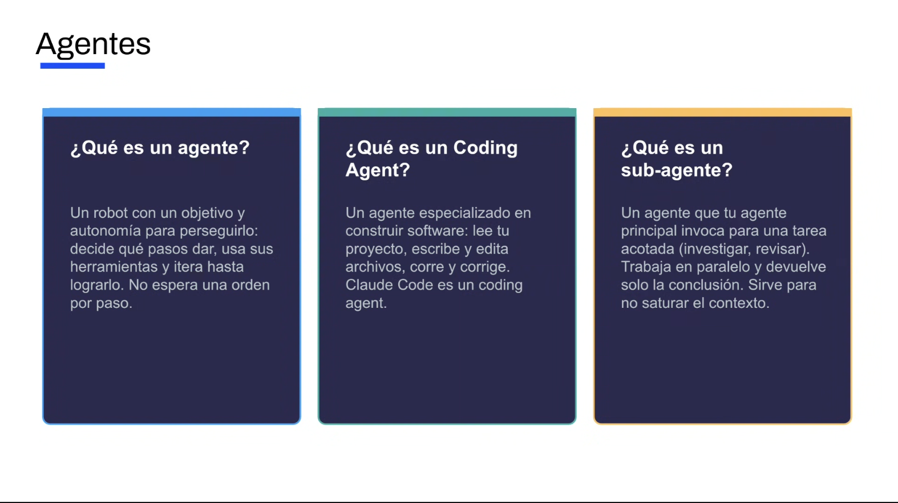
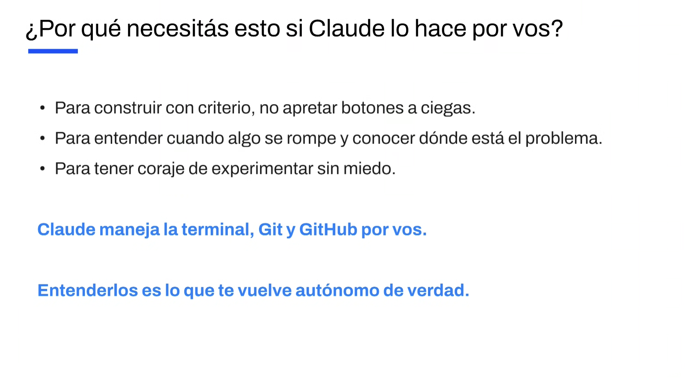
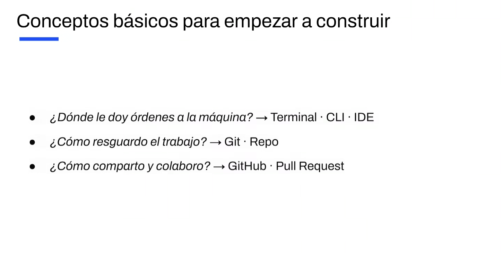
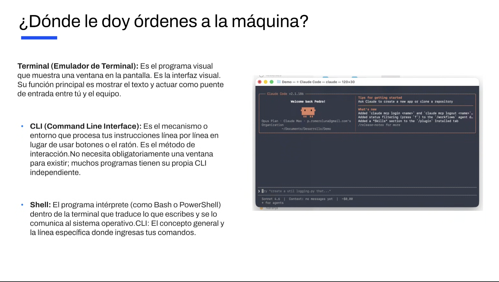
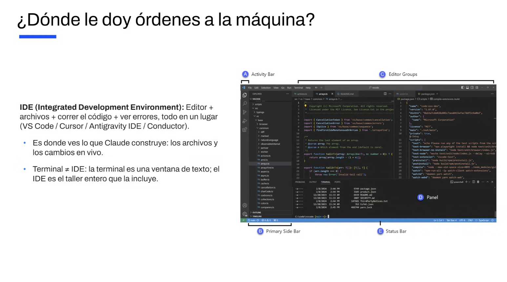
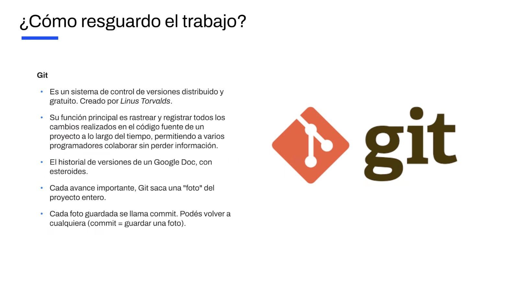
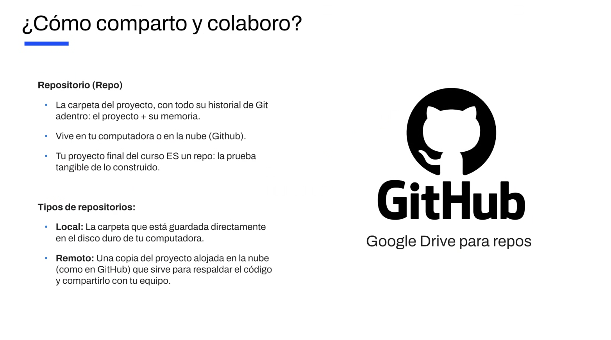
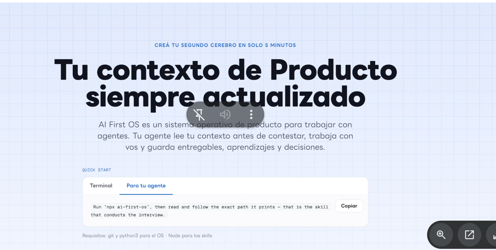
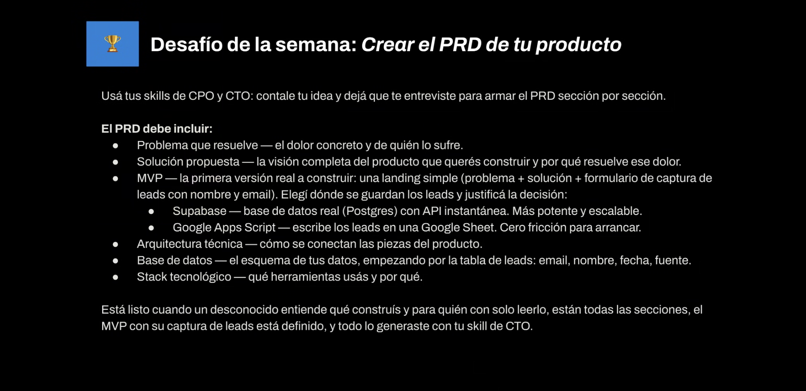

# Clase 1: Claude Code y fundamentos para construir

Apunte armado a partir de mis notas y de las slides de la clase, que están en `clase-01-imagenes/`.

## 1. Arquitectura de un agente

La idea central: esta arquitectura está debajo de cualquier sistema de IA. Claude Code es un agente.

| Parte | Equivale a | Qué es |
|---|---|---|
| 🧠 Cerebro | LLM | El modelo que razona |
| 💪 Cuerpo | Harness | La estructura que envuelve al modelo y lo hace operar |
| 🤲 Manos | MCP | Protocolo para conectar el agente con herramientas y datos externos (Gmail, Calendar, GitHub) |
| 📘 Manuales | Skills | Instrucciones para hacer una tarea de una forma determinada; se invocan automáticamente |
| 💾 Libreta | Memoria | De corto y largo plazo, en archivos como `CLAUDE.md` y `AGENTS.md` (estándar de la industria que Claude Code adoptó) |
| ✍️ Idioma | Markdown | Archivos `.md` de texto plano con jerarquía; es el idioma entre humanos y agentes, que entienden sobre todo inglés. Se pueden ver con Obsidian |

## 2. Agentes

- **Modelo vs. agente:** el chat es el modelo, que responde pero no ejecuta. Claude Code es IA agéntica: ejecuta tareas.
- **Agente:** tiene un objetivo y autonomía para perseguirlo. Decide los pasos, usa herramientas e itera, sin esperar una orden por cada paso.
- **Coding agent:** un agente especializado en software. Lee tu proyecto, escribe y edita archivos, corre el código y corrige. Ejemplos: Claude Code, Codex, Cursor.
- **Sub-agente:** un agente que crea el agente principal para una tarea acotada (investigar, revisar). Trabaja en paralelo, no tiene todo el contexto y devuelve solo la conclusión. Sirve para no saturar el contexto y sale más barato.
- **Sesiones:** las distintas sesiones de Claude Code no pueden darse órdenes entre sí.
- **Discovery ≠ desarrollo:** en desarrollo se delega todo al agente.

## 3. ¿Por qué entender esto si Claude lo hace por vos?

- Para construir con criterio y no apretar botones a ciegas.
- Para entender cuándo algo se rompe y dónde está el problema.
- Para animarse a experimentar sin miedo.
- Claude maneja la terminal, Git y GitHub por vos; entenderlos es lo que te vuelve autónomo.

## 4. Conceptos básicos para empezar a construir

| Pregunta | Respuesta |
|---|---|
| ¿Dónde le doy órdenes a la máquina? | Terminal · CLI · IDE |
| ¿Cómo resguardo el trabajo? | Git · Repo |
| ¿Cómo comparto y colaboro? | GitHub · Pull Request |

### Dónde le doy órdenes a la máquina

- **Terminal:** la ventana que muestra texto y hace de puente entre vos y el equipo.
- **CLI:** el método de interacción, línea por línea en lugar de botones. Muchos programas tienen la suya.
- **Shell:** el intérprete dentro de la terminal (Bash, PowerShell), que le traduce tus comandos al sistema operativo.

- **IDE:** editor + archivos + correr el código + ver errores, todo junto (VS Code, Cursor, Antigravity, Conductor). Es donde ves lo que Claude construye. La terminal es una ventana de texto; el IDE es el taller entero que la incluye.
- **Editores de texto:** para ver los Markdown que genera el agente por defecto.

### Cómo resguardo el trabajo: Git

- Sistema de control de versiones, gratuito, creado por Linus Torvalds.
- Registra todos los cambios del código y permite colaborar sin perder información. Es como el historial de versiones de un Google Doc, con esteroides.
- Cada "foto" guardada del proyecto es un **commit**, y podés volver a cualquiera.

### Cómo comparto y colaboro: repo y GitHub

- **Repo:** la carpeta del proyecto con su historial de Git: el proyecto más su memoria. Ahí también se guardan los specs.
- **Local:** en tu computadora. **Remoto:** en la nube (GitHub), para respaldar y compartir.
- **GitHub:** el Google Drive de los repos.
- El proyecto final del curso es un repo: la prueba tangible de lo construido.
- Tener todo en Markdown permite respuestas automáticas.

## 5. AI First OS (producthub.lat/aifirst)

- Un sistema operativo de producto para trabajar con agentes: el agente lee tu contexto antes de contestar y guarda entregables, aprendizajes y decisiones.
- Se instala pasándole el link a Claude, o con `npx ai-first-os`. Requisitos: git y python3, y Node para los skills (npm es el gestor de paquetes de Node).
- Skills del curso: `npx skills add pedroromeroluna/ai-first-product-skills`.

## 6. Desafío de la semana: crear el PRD de tu producto

Con los skills de CPO y CTO, dejando que te entrevisten sección por sección. Debe incluir:

- **Problema:** el dolor concreto y quién lo sufre.
- **Solución:** la visión completa y por qué resuelve el dolor.
- **MVP:** una landing con problema, solución y formulario de leads (nombre y email), justificando dónde se guardan: Supabase (Postgres, más potente) o Google Apps Script (Google Sheet, cero fricción).
- **Arquitectura técnica, base de datos** (empezando por la tabla de leads: email, nombre, fecha, fuente) **y stack**.

Está listo cuando un desconocido entiende qué construís y para quién, están todas las secciones y el MVP está definido, todo generado con el skill de CTO.

## Lo que hice después de la clase

- **Repo `emilia-producthub`:** conectado a GitHub, con los 13 skills del curso y AI First OS instalados. El cerebro tiene dos espacios: Marketplace PY y Curso Product Hub.
- **Skill `analista-cx`:** calcula métricas de CX (contact rate, recontacto, fail rate y más) a partir de exports del backoffice y de Salesforce.
- **Desafío:** exploré dos ideas. Elegí **nivelación de pádel** y descarté dashboards como producto. El PRD quedó completo con reservas, con benchmark, decisiones, arquitectura y la planilla de alternativas, en `products/nivelacion-de-padel/`. Los leads van a una Google Sheet y la landing a GitHub Pages, a costo cero.
- **Repo `nivel-padel-landing`:** creado y conectado; la landing todavía no está publicada.

## Pendientes de mis notas

- La explicación de **LLM** y **Harness** (solo están en la slide).
- **"transcript ="** y **"si copi"** quedaron cortados.
- Qué se hace en la etapa de **discovery**.
